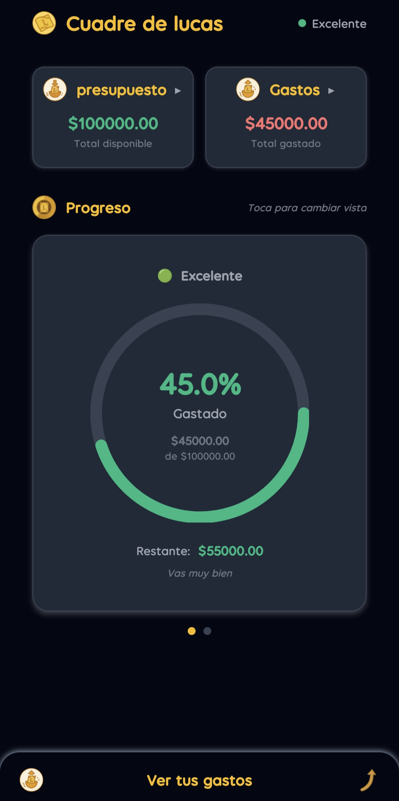
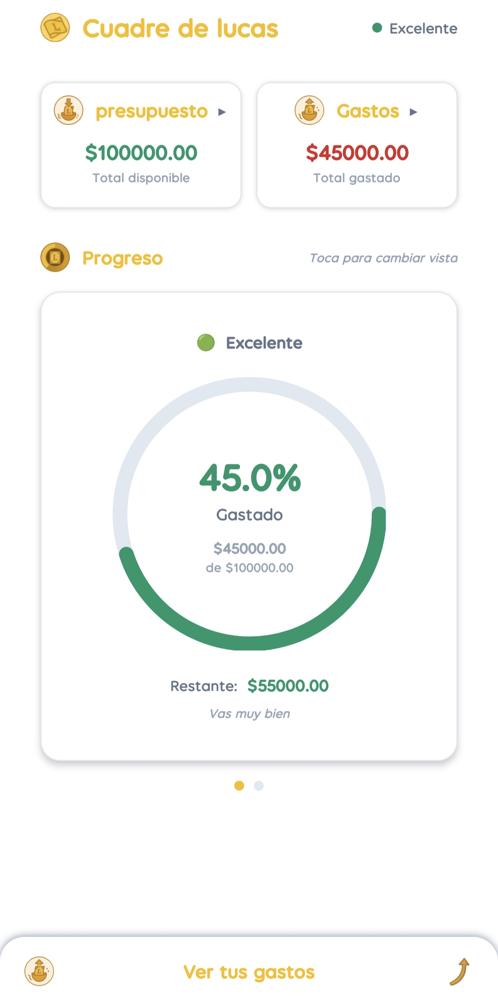
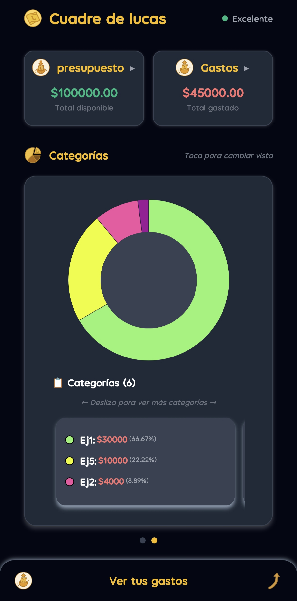
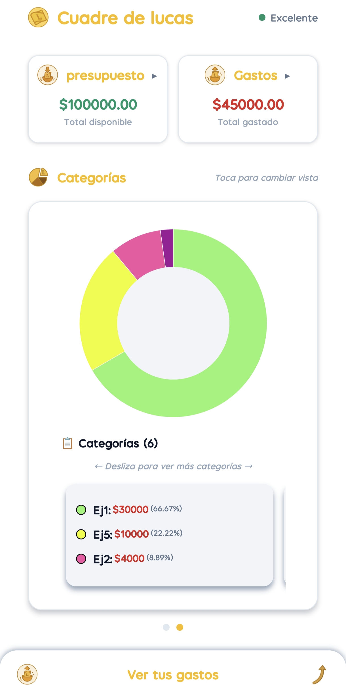

# Cuadrando las Lucas

<p align="center">
  
</p>

**Cuadrando las Lucas** es una aplicación móvil personal desarrollada en **React Native** que permite llevar el control de gastos y presupuesto mensual de manera sencilla, visual y privada.  
El proyecto fue creado como una herramienta **no lucrativa**, basada en los gustos y necesidades de su autor.

---

## 🚀 Características principales

- Registro de gastos por categorías.  
- Definición de un presupuesto mensual.  
- Visualización clara de lo gastado y lo disponible.  
- Gráficas intuitivas (Progreso y pastel).  
- Generación de reportes PDF **(actualmente en revisión, puede presentar errores en producción)**.  
- Reinicio automático de valores al cerrar el ciclo mensual.  
- Persistencia de datos en almacenamiento local (`AsyncStorage`).  
- Interfaz minimalista y sin publicidad.

---

## 🛠️ Tecnologías utilizadas

- **React Native** con [Expo](https://expo.dev/).  
- **TypeScript** para tipado y mantenibilidad.  
- **Zustand** para el manejo de estado global.  
- **AsyncStorage** para persistencia local de datos.
- **react-native-svg** y **react-native-chart-kit** para las gráficas.

---
## 📱 Probar la aplicación

Puedes descargar y probar la app directamente aquí (Android APK):  


<p align="center">
  <a href="https://expo.dev/artifacts/eas/xhHkDLYgaeyVGnkaYoiuGs.apk">
    
  </a>
</p>

---

## 📷 Capturas de pantalla

<p align="center">
  
  
</p>
<p align="center">
  
  
</p>

---

## 🔒 Filosofía del proyecto

- No busca recolectar datos personales ni monetizarse.  
- Hecho a la medida de las necesidades de su creador.  
- Enfocado en fomentar hábitos financieros saludables, sin complicaciones ni dependencias externas.  

---

## 📦 Instalación manual (DevMode)

Si prefieres ejecutar el proyecto desde el entorno de desarrollo:

1. Clona este repositorio:  
   ```bash
   git clone https://github.com/tuusuario/cuadrando-las-lucas.git
   cd cuadrando-las-lucas
2. Instala las dependencias
   ```bash
   npm install
3. Inicia el proyecto con Expo
   ```bash
   npx expo start
4. Escanea el código QR con la app de Expo Go en tu dispositivo móvil para probar la aplicación.

---
### 📌 Estado del proyecto

El proyecto está en uso, pero se sigue trabajando para mejorar y pulir aspectos que afectan la experiencia de usuario (UX).
Actualmente la función de generación de reportes en PDF se encuentra en revisión.